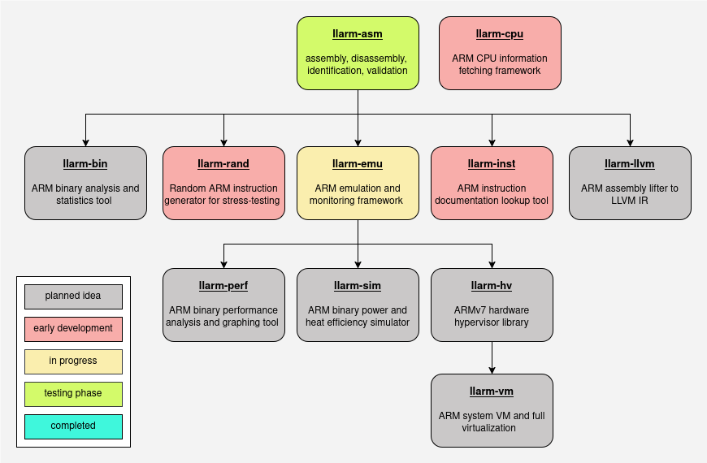

<h1 align="center">LLARM</h1>

<div align="center">
  
  <br>
  <small>Artwork by <a href="https://t04st3r.carrd.co/">t04st3r</a></small>
</div>
<br>
<br>


**LLARM** (Low Level ARM) is an infrastructure toolchain for the ARM architecture that provides libraries and/or tools for:
 - full system, CPU, and core emulation (`llarm-emu`)
 - instruction assembly, disassembly, identification, and validation (`llarm-asm`)
 - fetching ARM CPU information (`llarm-cpu`)
 - and many other sub-projects are planned or currently in development

- - -


## Development roadmap and dependency tree

<br>

<br>


## Build setup
```cmake
mkdir build && cd build
make
sudo make install
```

- - -

> [!NOTE]
> ## Note from the developer
> I've written approximately 40k lines of C++ so far and have been working on this project for nearly 2 years. At the moment, the project doesn't have any practical use in real-world scenarios in its current state (especially since it only supports AArch32 for now). That being said, my plan is to eventually support modern AArch64 architectures, but it's a very long way ahead.
>
> My ambition is to expand it into something much bigger than it already is. The reason why I'm sharing this colossal project now is because I wanted to publish the progress I've made so far, and maybe get feedback from people to determine what could be better. But for the moment, this is only the beginning. 
> 
> My objective is to provide a completely new framework to work with the ARM architecture, with goals to have it become a practical solution for many low-level embedded development requirements out there. Think of it as what LLVM is to compilers, but for ARM development.